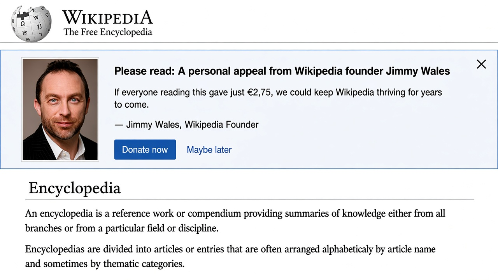

# Crying Jimmy

Browser extension for **Firefox** and **Google Chrome** that replaces Wikipedia’s modern fundraising banners with the classic **Jimmy Wales personal appeal** — stare included.

## Preview

## Install (Chrome / Chromium / Edge)

1. Download `crying_jimmy-*-chrome.zip` from the [GitHub Releases](https://github.com/Ignotus/crying-jimmy/releases) page
2. Unzip it to a folder you will keep
3. Open `chrome://extensions`
4. Enable **Developer mode**
5. Click **Load unpacked** and select that folder

Chrome does not install `.zip` files directly; the unpacked folder is the permanent install as long as you leave Developer mode on and don’t move/delete the folder.

## Install (Firefox)

1. Download the signed `crying_jimmy-*-firefox.xpi` from the [GitHub Releases](https://github.com/Ignotus/crying-jimmy/releases) page
2. Open Firefox → **Settings** → **Extensions & Themes** (or `about:addons`)
3. Click the gear icon → **Install Add-on From File…**
4. Select the downloaded `.xpi`

You can also drag the `.xpi` onto a Firefox window to install it.

## What it does

- Detects Wikimedia fundraising / CentralNotice banners on Wikipedia and sister projects
- Hides the modern copy (“Wikipedia still can’t be sold…”)
- Inserts a 2010-style banner: Jimmy’s photo, “Please read: A personal appeal…”, and a Donate button to `donate.wikimedia.org`
- Reuses the ask amount from Wikipedia’s own banner (e.g. `€2,75`, `$3`)
- Close / “Maybe later” hides it for 7 days (stored in `localStorage`)

## Files

| File | Role |
|------|------|
| `manifest.json` | Manifest V3 (Chrome + Firefox) |
| `content.js` | Banner detection & replacement |
| `content.css` | Classic banner styles |
| `images/jimmy.jpg` | Jimmy Wales fundraiser portrait |
| `icons/` | Extension icons |
| `screenshots/preview.png` | README preview |

Portrait credit: [Jimmy Wales Fundraiser Appeal](https://commons.wikimedia.org/wiki/File:Jimmy_Wales_Fundraiser_Appeal.JPG) on Wikimedia Commons.
